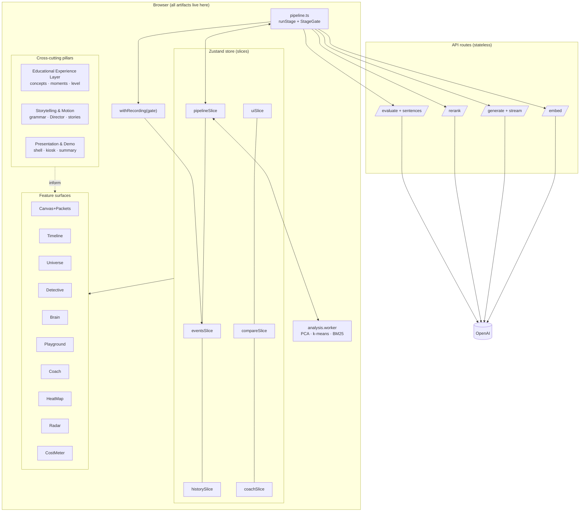
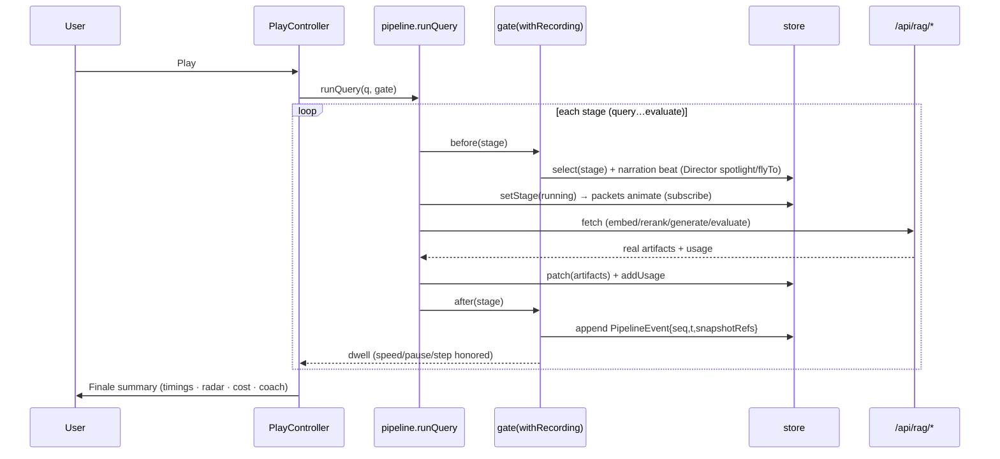
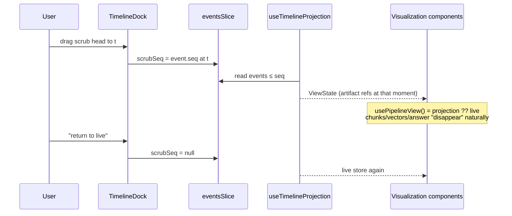

# RAG Pipeline Visualizer V2 — Architecture (Phase 2)

> Status: **awaiting approval** · Source spec: `RAG_V2_VISION.md` + education-first revision
> Prime directive: a person with zero RAG knowledge must intuitively understand how RAG
> works within five minutes, without documentation.

Every design decision below is judged against four questions the UI must answer at all times:

1. **What is happening?**
2. **Why is it happening?**
3. **How does it affect answer quality?**
4. **How can I improve it?**

---

## 0.0 Permanent Design Philosophy — the Interactive AI Museum

> Approved as a standing principle. Applies to every implementation decision in V2.

This application is an **Interactive AI Museum** — not a dashboard, not an observability
platform, not a developer tool.

- Every screen must make visitors **curious**.
- Every animation must **reveal something previously invisible**.
- Every interaction must **teach exactly one concept**.
- Every experiment must produce an **"Aha!" moment**.

**The Keynote Test** (applied to every feature before it ships): *"If this were shown
during an Apple keynote or an MIT AI lecture, would people remember it?"* If not,
redesign it before implementing further.

Twin guardrails, in permanent tension and both binding:
1. **Never sacrifice technical accuracy for visual appeal** — every visual binds to real
   pipeline data; honesty labels where interpretation is involved.
2. **Never sacrifice visual storytelling for technical complexity** — if a feature can
   only be shown as a table of numbers, its design isn't finished.

The ideal outcome: **users forget they are learning because exploration itself teaches
them.**

## 0. North Star & Design Philosophy

V2 is not a dashboard. It is an **interactive lesson that happens to be a real, working
RAG system**. The system processes real documents with real OpenAI calls; the lesson is
the way that processing is staged, narrated, and made tangible.

**The Five-Minute Test** (acceptance bar for the whole product):
a first-time visitor clicks **Play**, watches one full cinematic run on the sample
document, and can afterwards explain in their own words: documents are split into
chunks → chunks become vectors → questions find nearby vectors → found text is packed
into a prompt → the model answers only from that text → the answer is checked against
its sources.

**Three personas**, one interface with progressive disclosure:

| Persona | Entry point | What they need |
|---|---|---|
| Curious visitor | Play Mode | Story, analogies, zero jargon |
| Student / engineer | Explore + Inspector | Real numbers, tunable params, cause→effect |
| Presenter / consultant | Presentation Mode | Fullscreen cinematic demo, summary slide |

**Non-negotiable constraints carried from V1:**
- Light editorial theme as primary (user-mandated); dark visual language reserved for
  Presentation Mode only, where cinema justifies it.
- Minimum ~11 px type; readability beats density.
- No fake data anywhere: every animation binds to a real store value.
- Vercel-deployable: stateless API routes, all artifacts client-side.
- Webpack builds only (`next build --webpack`).

---

## 1. The Three Pillars (new architectural layers)

These are cross-cutting layers, not page sections. Every feature plugs into all three.

### Pillar A — Educational Experience Layer (EEL)

**Purpose:** guarantee the four questions are answerable from any pixel of the UI.

**A1. Concept Registry** — `education/concepts.ts`
A single typed source of truth for every concept in the system (~30 entries:
chunking, overlap, token, embedding, cosine similarity, hybrid search, BM25,
re-ranking, context window, grounding, hallucination, faithfulness…). Each entry:

```ts
interface Concept {
  id: ConceptId;
  term: string;              // "Chunk overlap"
  what: string;              // plain-English, one sentence
  why: string;               // why the pipeline does this
  analogy: string;           // beginner-mode metaphor
  qualityImpact: string;     // how it moves answer quality
  improve: string[];         // actionable levers, each referencing a real param
  relatedParams?: (keyof RagParams)[];
  relatedConcepts?: ConceptId[];
}
```

*Educational purpose:* one consistent voice everywhere. Tooltips, narration, the Coach,
the Detective, and Inside GPT's Brain all quote the registry — the learner hears the
same explanation phrased consistently, which is how terminology sticks.

**A2. `<Concept>` affordance** — `education/ConceptCard.tsx`
Any term or metric in the UI can be wrapped: `<Concept id="overlap">chunk overlap</Concept>`.
Renders a subtle dotted underline; hover/tap opens a card with the four answers
(What / Why / Quality impact / Improve) plus "adjust it →" deep-links that scroll to and
pulse the relevant parameter slider.

*Educational purpose:* the single most important learnability device — a **uniform
affordance** meaning "this is explainable." Learners stop fearing jargon because every
piece of jargon is one hover from a plain answer, and every explanation ends with a
lever they can pull ("How can I improve it?" answered literally).

**A3. Learning Moments engine** — `education/learningMoments.ts`
A rule set subscribed to store transitions. When real pipeline data crosses a teachable
threshold, a small dismissible toast appears anchored to the relevant component:

- `candidates.filter(c => c.hybrid < threshold).length > N` → "12 chunks scored below
  your similarity threshold and were rejected — that's the threshold doing its job. Too
  strict and you starve the model of context; too loose and you feed it noise."
- rerank moved a chunk into top-K → "Re-ranking just promoted chunk 7 from rank 6 to
  rank 2 — the fast vector search underrated it; the LLM reader recognized its relevance."
- context utilization < 40 % → "You're paying for a context window you're not filling."

Rules fire from **real values only** (no canned demos), at most one visible at a time,
frequency-capped, dismiss-remembered in `localStorage`.

*Educational purpose:* converts live system behaviour into micro-lessons at the moment
of maximum curiosity — the learner just *saw* the thing happen.

**A4. Persona System** — `education/personas.ts`, persisted in `uiSlice`

The interface adapts to five audiences. Personas are **configuration profiles over
shared capability axes** — not five forked UIs. One component tree; personas select
copy voice, detail depth, which surfaces are featured/collapsed/hidden, and which
metrics lead.

```ts
type PersonaId = "student" | "engineer" | "researcher" | "executive" | "presenter";

interface PersonaProfile {
  id: PersonaId;
  voice: "analogy" | "technical" | "statistical" | "business" | "narrative";
  depth: 0 | 1 | 2 | 3;                 // raw-detail exposure
  featured: FeatureId[];                 // opened/promoted surfaces
  collapsed: FeatureId[];                // present but folded
  hidden: FeatureId[];                   // removed from chrome (still routable)
  metricsLens: "learning" | "debugging" | "evaluation" | "roi" | "showtime";
  defaultMode: UiMode;                   // explore | present
  journeyEnabled: boolean;
}
```

| Persona | Leads with | Depth | Featured | Hidden/de-emphasized |
|---|---|---|---|---|
| **Student** | analogies, animations, guided journey | 1 | Play Mode, Concept cards, Learning Moments, Universe | raw JSON, latency distributions |
| **AI Engineer** | implementation truth | 3 | per-stage **JSON artifact tab** in the Inspector, timings, prompt construction, embeddings, debugging notes, Lab | analogy copy recedes |
| **Researcher** | measurement | 3 | eval metrics, retrieval statistics, **latency distributions across runs**, embedding characteristics (dim stats, cluster quality), A/B comparison | narrative chrome |
| **Executive** | outcomes | 0 | **Outcome view**: accuracy (eval), latency, cost/question, monthly estimate, **ROI card** | pipeline internals collapse to a single "how it works" strip |
| **Presenter** | the show | 1 | Presentation Mode by default, cinematic arcs, **speaker notes**, minimal controls, big type | parameter panels, docks |

Implementation notes:
- **One registry, persona-composed copy** — concepts are *not* written five times. Each
  `Concept` carries `what/why/analogy/qualityImpact/improve` (+ optional `technical`);
  the persona's `voice` decides composition order and emphasis (student leads with
  `analogy`, engineer with `technical`, executive with `qualityImpact` + cost).
- Components read one hook, `usePersona()`, exposing `voice/depth/lens` and
  `isFeatured(f)/isHidden(f)` — no `if (persona === "student")` scattered in views.
- **Honesty rule for the Executive ROI card:** accuracy, latency, and cost are real
  measured values; ROI projections use **user-editable, clearly-labeled assumptions**
  (questions/month, analyst cost/hour) — assumption inputs are visible on the card, so
  no number is fake.
- Persona picker: first-visit welcome ("Who's exploring today?") + always switchable
  from the header. Switching personas re-lenses the current state instantly — same data,
  new lens (itself a teachable moment about audiences).
- This subsumes the earlier `story/engineer` toggle: wherever this document says
  "story level" or "engineer level," read it as the **depth/voice facet of the active
  persona** (student ≈ story; engineer/researcher ≈ engineer).

*Educational purpose:* the same pipeline explained five ways *is the lesson* that
technical systems have multiple valid descriptions. Nobody is patronized (engineers get
JSON) and nobody is overwhelmed (executives get outcomes) — scaffolding matched to the
learner, the core of good pedagogy.

**A5. Learning Journey layer** — `journey/`

First-time users are guided through progressively more advanced concepts instead of
facing all 18 features at once.

- `journey/curriculum.ts`: an ordered curriculum of ~8 chapters, each
  `{ id, title, goal, trigger, spotlightTarget, conceptIds, completion }`:
  1. *Ingest a document* → 2. *Ask your first question* → 3. *Open a pipeline node* →
  4. *Trace an answer to its source* (Detective) → 5. *Tune a parameter and re-ask* →
  6. *Break it on purpose* (Lab) → 7. *Compare two configurations* (A/B) →
  8. *Present it to someone* (Play/Present).
- **Completion is detected from real store events**, never from "clicked next": chapter
  4 completes when the user actually reaches a source chunk from a citation.
- UI: a slim progress ring + current-chapter chip in the header; the active chapter's
  target gets a gentle Director spotlight the first time it becomes relevant; a chapter
  card (dismissible) explains the goal in persona voice. Never modal, never blocking —
  explorers who ignore it lose nothing.
- **Progressive disclosure**: for journey-enabled personas (student default), advanced
  docks (Lab, A/B, Radar detail) start collapsed until their chapter unlocks — visible
  but folded with an "unlocks in chapter n — or open now" affordance (soft gating only;
  nothing is ever locked).
- Progress persisted in `localStorage`; "restart journey" available; journey off by
  default for engineer/researcher/presenter (toggleable).

*Educational purpose:* sequencing. Working memory is the bottleneck for novices; the
journey rations new concepts (one chapter ≈ one concept cluster) and converts the
feature set from an intimidating wall into a plot.

**A6. Educational objective mapping** — `education/objectives.ts`

Every feature must justify its existence pedagogically, enforced in CI:

```ts
interface EducationalObjective {
  id: string;
  statement: string;                      // "Learner can explain why chunk overlap exists"
  answers: ("what" | "why" | "quality" | "improve")[];
}
// FEATURE_OBJECTIVES: Record<FeatureId, ObjectiveId[]>  — every FeatureId present, ≥ 1 objective
// SCREEN_ANSWERS: every mode surface declares how it answers the four questions
```

A unit test fails the build if any feature lacks an objective or any registered screen
leaves one of the four questions unanswered (What is happening? Why? How does it affect
answer quality? How can I improve it?). This turns the education-first mandate from a
review guideline into a compiler-adjacent guarantee.

### Pillar B — Storytelling & Motion System

**Purpose:** animation as explanation. Every motion is a sentence in a visual language.

**B1. Motion Grammar** — `motion/grammar.ts`
A fixed, documented vocabulary. Each entry maps a *meaning* to a *motion*, and every
animated element in V2 must cite one:

| Grammar token | Motion | Meaning it teaches | Bound to (real data) |
|---|---|---|---|
| `packet-flow` | dot/card travels along an edge | data is moving between stages | stage transition events |
| `pulse` | soft border breathing | this component is computing | `status === "running"` |
| `settle` | scale 1.04→1 + glow fade-in | work completed, result is trustworthy | `status === "done"` |
| `recede` | opacity → 0.45 | not relevant right now | play-mode dimming / rejection |
| `attract` | element eases toward target | semantic similarity ("pulled closer") | cosine scores |
| `fill` | container fills bottom-up | capacity being consumed | context-budget tokens |
| `overflow` | item slides out of container | limits force exclusion | budget-trimmed chunks |
| `trace` | line draws point-to-point | provenance, "this came from that" | citations |
| `shake` (subtle) | 2px x-jitter, red | something failed | `status === "error"` |

Reduced-motion variants defined per token (see §11).

*Educational purpose:* consistency makes motion legible. When "settle" always means
"done and trustworthy," the learner reads the pipeline like a sentence rather than
watching fireworks.

**B2. The Director** — `motion/director.ts`
One orchestration module owning cinematic sequences, built on **GSAP timelines**
(installed, currently unused) for anything that needs scrubbing/seeking, cooperating
with Framer Motion (component enter/exit) and R3F (3D camera).

Capabilities exposed as composable primitives:
- `spotlight(stageId)` — dim all but one node (CSS var opacity, GPU-only)
- `flyTo(stageId | rect)` — camera pan/zoom via `transform: translate/scale` on the
  canvas wrapper (no layout thrash, 60 fps)
- `fadeChrome(level)` — presentation UI fade
- `beat(narration, {duration})` — narration + dwell, honoring speed/pause/step
- `sequence([...])` — a seekable GSAP master timeline

Consumers: Play Mode, Presentation Mode, AI Detective, Inside GPT's Brain, Replay
Timeline (scrubbing re-seeks Director sequences).

*Educational purpose:* attention management. A first-time learner cannot know where to
look among 14 nodes; the Director looks *for* them, one concept at a time.

**B3. Narrative arcs** — `stories/*.ts`
Three scripted arcs, each a list of beats `{stageId | target, narration, level-variants,
grammarTokens}` quoting the Concept Registry:

1. **"The journey of a document"** — ingestion (upload → index)
2. **"The journey of a question"** — query (query → evaluate)
3. **"The anatomy of an answer"** — backwards trace (Detective/Brain share it)

Narration exists in both `story` and `engineer` variants.

*Educational purpose:* narrative sequencing is how humans retain process knowledge.
The arcs give the pipeline a beginning, tension (will the right chunks be found?), and
resolution (a grounded, evaluated answer).

### Pillar C — Presentation & Demo Mode

**Purpose:** the product must also *perform* — for classrooms, client demos, kiosks.

**C1. Presentation Shell** — `presentation/PresentationShell.tsx`
- Fullscreen (`requestFullscreen`), chrome faded via Director, **cinematic dark
  variant** of the theme (the one sanctioned dark context), large-type narration
  (24 px+), stage visuals scaled up.
- Hotkeys: `Space` pause/resume, `→/←` step, `↑/↓` speed, `Esc` exit, `S` toggle sound.
- Runs the two narrative arcs end-to-end using the same `usePlayController` gates.

**C2. Kiosk Loop** — auto-restart with sample doc + rotating sample questions,
idle-timeout return-to-start. For booths/lobby screens.

**C3. Finale Summary Slide** — at arc end, a single composed slide (also shown after
normal Play Mode, smaller): timings ribbon, eval radar, cost line, and the Coach's top
3 suggestions. All values from the live store.

*Educational purpose:* the summary is the "lesson recap" — spaced repetition of the
run's key numbers, and the bridge from *watching* to *experimenting* ("try lowering
top-K and run again").

---

## 2. Feature Architecture (V2 features mapped to pillars)

Each feature lists its **educational purpose** (the four questions) and its technical shape.

### F1 · Living Data Flow (canvas upgrade)
**Teaches:** *what is happening* — data physically transforms as it moves: pages become
chunks, chunks become vectors, vectors become candidates.

- New `canvas/EdgeLayer.tsx`: one absolutely-positioned SVG spanning the canvas; edges
  are measured paths between node DOM rects (ResizeObserver-cached).
- `canvas/PacketSystem.ts`: rAF loop animating **typed packets** along paths — the packet
  *glyph reflects the payload* (📄 page icon → ▤ chunk card → ⟨…⟩ vector glyph → ranked
  badge). Count and cadence bind to real artifact counts (e.g. 23 chunks → 23 packet
  ticks, batched visually above 40).
- Node states use grammar tokens: `pulse` (running), `settle` (done), `recede`
  (inactive during play), `shake` (error).
- React Flow **not** adopted — decision rationale in §7.

### F2 · Replay Timeline
**Teaches:** *what happened and in what order*; makes latency tangible (embedding is
slow, retrieval is instant); enables "watch that again" — repetition on demand.

- `lib/events.ts`: event-sourced log. StageGate `after` records
  `PipelineEvent { seq, t, stage, phase, snapshot: ArtifactRefs, meta }`.
  Snapshots are **by reference** — V1's store discipline is replacement-not-mutation, so
  a snapshot is a bag of pointers (chunks[], embeddings, candidates, promptBlocks,
  answerSentences, evalScores at that moment). Cost: pointers, not copies.
- `timeline/TimelineDock.tsx`: docked bar under the canvas. D3-scaled time ruler, one
  block per stage (width = real duration), color by group (blue ingestion / violet
  query). Scrub head + transport buttons shared with Play Mode.
- **Scrubbing = projection, not mutation**: `timeline/useTimelineProjection.ts` derives a
  read-only `ViewState` from the event ≤ scrub position; visualization components read
  `viewState ?? liveState` through one selector hook (`usePipelineView()`). The live
  store is never rewound; "return to live" clears the projection. Scrubbing during an
  in-flight run pauses packet animation and banners "viewing history — pipeline still
  running."
- Rewind visuals: chunks/vectors/prompt/answer disappear because the projection at that
  seq simply doesn't contain them — no special-case animation code.

### F3 · Cinematic Play Mode (upgrade)
**Teaches:** the full causal chain, narrated, one stage at a time.
- Keeps `usePlayController` gates; adds Director spotlighting + `flyTo` per beat,
  chrome fade at 0.6 opacity, narration cards quoting the arcs (level-aware).
- End: Finale Summary (C3).

### F4 · Embedding Universe
**Teaches:** *why retrieval works* — meaning has geometry; similar text is literally
near; the question travels to its neighbourhood. This is the "aha" centerpiece.

- `universe/UniverseScene.tsx` (lazy): single R3F canvas.
- **InstancedMesh** for chunks (per-instance color/scale attributes) — 1000+ at 60 fps.
- `lib/workers/analysis.worker.ts` computes PCA-3 **and k-means clusters** (k = √(n/2)
  capped 8) off-thread; clusters get soft halo sprites + auto-labels (top-TF terms of
  member chunks — real data, no LLM call needed; engineer level shows the terms).
- Query = a small glowing craft: on ask, it flies a Catmull-Rom path from viewport edge
  toward the retrieved centroid (`attract` grammar); nearest chunks `settle`-glow in
  retrieval order; `trace` lines draw to the survivors.
- Hover (instanceId raycast): tooltip with chunk, page, tokens, similarity, retrieved?,
  cited-in-answer? (the two flags come from `results` and `answerSentences` — real).
- Beginner copy: "each dot is a passage from your document; closeness = similar meaning."
- Fallback + a11y: "data view" table toggle (sorted by similarity) — same information,
  no WebGL. Doubles as the reduced-motion and screen-reader path.

### F5 · AI Detective
**Teaches:** *why does this answer exist* — provenance, in reverse. Answers "why should
I trust it?"

- `detective/DetectiveMode.tsx`: entered by an "explain this answer" button on the
  answer card, or by clicking any cited sentence.
- A Director-driven backwards walk (arc 3): Answer sentence → its citations → the prompt
  block containing them → their rerank/hybrid scores (bar comparison vs rejected
  candidates) → their position in the universe (mini-map inset) → the exact page region
  (PDF page render with the chunk's text region highlighted).
- Each step is a card with `trace` lines connecting to the previous step; learner can
  advance/step-back or exit to inspect any node.
- Unsupported sentences (no citations) route to the Hallucination Radar view (F13) with
  the "missing evidence" explanation.

### F6 · Chunk Life Story
**Teaches:** chunks are persistent citizens with careers — some are workhorses, some
never get picked; connects param choices to which text ever reaches the model.

- `lib/history.ts` + `historySlice`: per-chunk accumulator across queries within a
  document session: `{ retrievals, rerankPromotions, promptAppearances, citations,
  similarityHistory[], lastUsedSeq }`. Reset only on new document.
- `ChunkProfile.tsx`: opened from any chunk card anywhere (Inspector, sources,
  universe tooltip "view profile"). Shows identity (id, page, section heading if
  detectable, chars/tokens/overlap), embedding meta, a sparkline of similarity across
  queries (D3 scale), counters, and a mini-timeline of its lifecycle events.

### F7 · Retrieval Heat Map
**Teaches:** *where the knowledge lives* — which parts of the document actually answer
questions; instantly shows why "just upload everything" ≠ "everything gets used."

- Uses `historySlice` page-level counters + existing `renderPdfPage`.
- `heatmap/HeatMapView.tsx`: page thumbnails in a strip; overlay tint via D3
  `scaleSequential` (gray → yellow → orange → red by retrieval frequency); legend
  states plainly: "red = this page answers your questions most often."
- Click a page → zoomed render with per-chunk region tints + chunk profiles.

### F8 · Prompt MRI
**Teaches:** the prompt is *assembled, not typed* — the model only ever sees this
package; sets up the grounding concept.

- Upgrade of PromptView: expandable sections per block (System / Retrieved Context /
  User Question — "Conversation" appears only if multi-turn ships later; we do not fake
  it), token % donut (D3 arc), char counts, per-chunk sub-blocks inside Context with
  `trace` hover-links back to source chunks.

### F9 · Context Window Visualizer
**Teaches:** context is a *finite container* — the single most misunderstood RAG
constraint.

- `prompt/ContextContainer.tsx`: a vertical vessel (SVG) with capacity = contextBudget
  tokens. During the prompt stage, chunk blocks physically drop in (`fill` grammar,
  height ∝ real tokens). A chunk that exceeds the budget visibly fails to fit and
  slides out (`overflow`) with a learning-moment: "chunk 9 didn't fit — raise the budget
  or shrink chunks."
- Live-bound: dragging contextBudget resizes the vessel and re-flows blocks instantly
  (pure local computation).

### F10 · Interactive Cost Meter
**Teaches:** every question has a price; parameters are economic levers, not just
quality levers.

- `metrics/CostMeter.tsx` with `react-countup` odometer counters (installed, unused):
  session cost, last-question cost, embed vs generate split (stacked bar), today's cost
  (localStorage day-bucket), monthly estimate (today × 30, clearly labeled estimate),
  latency per stage.
- Cost deltas pulse when a real API response lands (`settle` grammar).
- Learning-moment hooks: "re-ranking cost $0.0004 this question and changed 2 results —
  worth it? Try toggling it off and compare."

### F11 · Parameter Playground (A/B)
**Teaches:** *how can I improve it* — the experimental method itself: change one
variable, hold the rest, compare outcomes.

- **Snapshot-and-compare** model (not parallel stores): `compareSlice` holds
  `{ armA: RunRecord, armB: RunRecord }` where `RunRecord = { params, question,
  chunkCount, timings, usage, evalScores, retrievedIds, answer }` — captured from
  completed runs.
- Flow: "Pin this run as A" → change params (UI highlights the diff) → run again →
  "Compare." Embeddings are **reused** when chunk params are unchanged (zero extra
  embed cost); when they differ, a cost preview is shown before running arm B.
- `playground/DiffView.tsx`: side-by-side columns — param diff table (changed rows
  highlighted), latency bars, cost, eval radar overlay (two translucent polygons),
  retrieved-chunk Venn strip (shared vs unique chunks), both answers with citation
  counts. Every metric row has a `<Concept>` link.
- Mobile: stacked with sticky A/B switcher.

### F12 · AI Lab Mode (guided experiments)
**Teaches:** failure modes — the fastest way to understand a system is to break it on
purpose.

- `lab/experiments.ts`: curated presets, each `{ id, title, paramPatch, hypothesis,
  whatToWatch, explanation }`: "No overlap", "Giant chunks", "Tiny chunks", "Top-K = 1",
  "Top-K = 8", "Rerank off", "Keyword-only", "Semantic-only", "Starved context".
- Running an experiment: shows the **hypothesis first** ("what do you think will
  happen?" — prediction before observation, a proven learning technique), applies the
  patch via existing `rechunkLocal`/`rescoreLocal`/`reembed`, runs, then the
  **explanation engine** compares actuals vs the pinned baseline and explains *why* in
  registry language — never just "performance worse."
- Explanation engine = deterministic heuristics over real diffs (recall proxy: retrieved
  overlap with baseline citations; context utilization; eval deltas), with one optional
  LLM call for narrative polish (engineer level shows the raw heuristics).

### F13 · Hallucination Radar
**Teaches:** "grounded" is checkable — trust is a property you can inspect per sentence.

- `evaluate` API extended: judge also classifies each answer sentence
  `{ index, support: "supported" | "weak" | "unsupported", evidenceChunkIds }`
  (sentence list sent from client, capped at 25; response JSON-mode).
- `radar/EvalRadar.tsx`: D3 radar polygon of the five scores replacing bars (engineer
  level keeps bars alongside).
- Answer card sentences tint by support (green/amber underline/red); clicking an
  unsupported sentence opens the evidence panel: nearest chunks that *almost* support it
  (cosine on demand against sentence embedding — one cheap embed call), plus retrieval
  improvement suggestions from the Coach rules.

### F14 · Smart AI Coach
**Teaches:** *how can I improve it* — closes every loop with a next action.

- `coach/insights.ts`: pure-function rule set over store + history:
  context utilization, threshold survivor count, rerank movement, overlap ratio, topK
  vs citations actually used, cost per question vs param waste, eval score patterns.
  Each rule emits `{ severity, finding, why, action: {label, paramPatch | link},
  estImpact }` — estimates computed from real numbers (e.g. "dropping topK 8→4 saves
  ~620 prompt tokens ≈ $0.0002/question ≈ 31 % of question cost").
- `coach/CoachPanel.tsx`: ambient, collapsed to a small badge with count; expanded shows
  ranked cards with one-click "apply" (uses existing param plumbing). Never modal, never
  nagging.

### F15 · Animation System → subsumed by Pillar B (grammar + Director + rAF/GSAP/R3F layers, §5)

### F16 · Sound Design
- `audio/sound.ts`: Web Audio synthesized cues (no asset downloads): soft tick =
  packet batch, low pad while a stage runs, resolve chime = `settle`, muted thud =
  error. **Default OFF**, toggle persisted; respects `prefers-reduced-motion` as a
  proxy signal to stay off; presentation mode offers a subtle generative pad.
- *Educational purpose:* audio reinforces state changes when eyes are elsewhere
  (presenter talking to an audience); strictly redundant — never sole carrier of info.

### F17 · Design Language
- Light editorial theme remains primary (site-matching, user-mandated). V2 adds
  **depth**: layered soft shadows, 1px inner highlights, neural gradient accents
  (existing blue→violet), animated light sweep on `settle`, glass only for overlays
  (narration card, tooltips) where blur has function (separating layer from content).
- **Dark cinematic variant** exists solely inside Presentation Mode.
- Type scale unchanged (Space Grotesk 900 lowercase display / JetBrains Mono labels /
  min ~11 px).

### F18 · Inside GPT's Brain — *Educational Simulation* (new)
**Teaches:** what the model *actually receives and produces* — demystifying generation
without pretending to read its mind.

**Honesty contract (hard requirement):** a persistent badge — "**Educational
Simulation** — a visualization of observable inputs and outputs, not the model's
internal reasoning" — rendered by `brain/SimulationBadge.tsx` and shown whenever the
mode is active. Narration never says "the model is thinking X"; it says "we can observe
X entering / leaving the model."

Five acts, each bound to observable data only:

| Act | Visualization | Real data source |
|---|---|---|
| 1. Prompt ingestion | The assembled prompt blocks flow into a stylized model vessel; token counter spins up | `promptBlocks`, real token counts |
| 2. Context usage | Inside the vessel, chunk blocks arrange as the working set; budget ring shows window occupancy | prompt-stage `kept` chunks + budgets |
| 3. Token generation | **Real streamed tokens** appear one by one, accumulating into the answer | streaming `generate` route (SSE) — the one backend change: `/api/rag/generate` gains a streamed mode returning token deltas |
| 4. Evidence selection | As citation markers `[n]` stream out, `trace` lines light from the answer-in-progress back to the exact context chunks | citations parsed live from the stream |
| 5. Grounded assembly | Finished sentences settle into the answer card, tinted by their (post-hoc) support classification | `answerSentences` + F13 support data |

- Entered from the generate node or a "watch the model work" button; can run live
  (during a real generation) or as a replay of the last generation from the event log.
- Engineer level adds: streaming tokens/sec, time-to-first-token, completion token
  meter vs `maxTokens`.
- *Why streaming matters:* it converts the single fake-feeling "answer appears" moment
  into the most honest animation in the app — those tokens arrive in exactly that
  order from the real model.

---

## 3. Component Architecture & Folder Structure

```
src/app/learn/rag/
  page.tsx, layout.tsx                     (unchanged)
  _components/
    RagShell.tsx                           (evolved: mode switcher, dock hosts)
    theme.ts                               (extended: depth tokens + presentation dark set)
    ragStore.ts                            (split into slices, same public API)
    stages.ts                              (narration moves to stories/, defs stay)
    core/                                  ← V1 components, evolved in place
      PipelineCanvas.tsx  Inspector.tsx  AnswerPanel.tsx
      ParamsPanel.tsx     MetricsPanel.tsx PlayMode.tsx
    canvas/
      EdgeLayer.tsx  PacketSystem.ts  useNodeRects.ts  CameraRig.tsx
    education/
      concepts.ts  ConceptCard.tsx  learningMoments.ts
      personas.ts  usePersona.ts  PersonaPicker.tsx  objectives.ts
    journey/
      curriculum.ts  JourneyChip.tsx  ChapterCard.tsx  useJourney.ts
    motion/
      grammar.ts  director.ts  useSpotlight.ts  reducedMotion.ts
    stories/
      documentJourney.ts  questionJourney.ts  answerAnatomy.ts  types.ts
    timeline/
      TimelineDock.tsx  Scrubber.tsx  useTimelineProjection.ts
    universe/
      UniverseScene.tsx  InstancedChunks.tsx  QueryShip.tsx
      ClusterHalos.tsx  UniverseDataView.tsx  useUniverse.ts
    detective/
      DetectiveMode.tsx  TraceStep.tsx  EvidencePath.tsx
    brain/
      BrainMode.tsx  TokenStream.tsx  ContextVessel.tsx  SimulationBadge.tsx
    prompt/
      PromptMRI.tsx  ContextContainer.tsx
    playground/
      ComparePanel.tsx  DiffView.tsx  useCompare.ts
    lab/
      experiments.ts  LabPanel.tsx  ExplanationEngine.ts
    coach/
      insights.ts  CoachPanel.tsx
    radar/
      EvalRadar.tsx  SentenceEvidence.tsx
    heatmap/
      HeatMapView.tsx  PageThumb.tsx
    metrics/
      CostMeter.tsx
    presentation/
      PresentationShell.tsx  KioskLoop.tsx  SummarySlide.tsx  useHotkeys.ts
    audio/
      sound.ts  SoundToggle.tsx
    lib/                                   ← V1 pure libs, extended
      pipeline.ts  text.ts  retrieval.ts  pdf.ts  sample.ts
      events.ts  history.ts  persist.ts
      workers/ analysis.worker.ts  workerClient.ts
src/app/api/rag/
  _lib/openai.ts          (extended: streaming helper)
  embed/ generate/ rerank/ evaluate/       (generate + evaluate extended, others frozen)
docs/
  RAG_V2_ARCHITECTURE.md  RAG_V2_STORYBOARD.md (Phase 2)  RAG_V2_ROADMAP.md (Phase 3)
tests/  (vitest units co-located as *.test.ts; e2e/ for Playwright)
```

**Why this shape:** feature folders match the vision's feature list one-to-one (a
reviewer can diff spec ↔ code by folder name); `core/` quarantines V1 so "never break
existing functionality" is auditable; pure logic stays in `lib/` + `education/` +
`coach/` where unit tests need no DOM.

---

## 4. State Management Design

Single Zustand store, split into **slices** composed at create-time (standard Zustand
slice pattern). The V1 public API (`useRagStore`, selectors, actions) is preserved so
untouched V1 components keep working.

```
pipelineSlice   (V1: artifacts, stages, params, usage, runId, play)   — unchanged shape
eventsSlice     { events: PipelineEvent[], scrubSeq: number | null }
historySlice    { chunkHistory: Map<id, ChunkHistory>, pageHeat: Map<page, n>,
                  costDays: Record<isoDate, number> }                 — persist: costDays
uiSlice         { mode: "explore"|"play"|"present"|"detective"|"brain"|"compare",
                  persona: PersonaId, soundOn, theme: "light"|"cinema",
                  dismissedMoments: string[] }                        — persist
journeySlice    { chapter: number, completed: ChapterId[], enabled: boolean } — persist
compareSlice    { armA?: RunRecord, armB?: RunRecord }
coachSlice      { insights: Insight[] } (derived, recomputed on stage completion)
```

Key rules:

1. **Artifacts are replaced, never mutated** (V1 discipline, now load-bearing): event
   snapshots and A/B RunRecords are reference-bags; timeline projection is safe because
   old references stay valid.
2. **Projection over mutation:** timeline scrubbing produces a derived `ViewState`;
   a single hook `usePipelineView()` returns `projection ?? live`. Only visualization
   components use it; ParamsPanel/actions always talk to live state (you can't edit
   the past).
3. **Recording is a gate, not a fork:** `withRecording(gate)` wraps any StageGate and
   appends events — Play Mode, manual runs, and experiments all record identically.
4. **Persistence** via a tiny `persist.ts` (localStorage, versioned keys, try/catch) —
   only `costDays`, ui prefs, dismissed moments. Artifacts never persist (privacy: the
   user's PDF content stays in-memory only — worth stating in the UI).
5. **Derived data memoized** in hooks (`useUniverse`, `useCompare`) with shallow
   selectors — no derived data stored unless expensive (PCA/k-means results live in
   pipelineSlice, computed in the worker).

---

## 5. Animation Architecture

Four layers with strict responsibilities (mixing them is the classic 60 fps killer):

| Layer | Tech | Owns | Never does |
|---|---|---|---|
| 1. Component | Framer Motion | enter/exit, layout, hover/tap | per-frame loops |
| 2. Cinematic | GSAP timelines (Director) | camera, spotlight, chrome fade, seekable sequences | React state per frame |
| 3. Particles | rAF + direct DOM/SVG transforms (PacketSystem) | packets, token stream, container fill | React re-renders (writes `transform` only) |
| 4. 3D | R3F `useFrame` | universe motion, ship flight | allocation per frame |

- All per-frame writes are `transform`/`opacity` only (compositor-only properties).
- PacketSystem subscribes to the store **outside React** (`useRagStore.subscribe`) and
  renders into the EdgeLayer SVG imperatively; React owns the SVG container, not the dots.
- The Director exposes `seek(t)` so the Replay Timeline scrub head can drive cinematic
  sequences deterministically.
- Every grammar token defines a `reducedMotion` variant (§11): typically instant state
  change + static highlight.

**Animation storyboard** (deliverable #4) ships as `docs/RAG_V2_STORYBOARD.md` in
Phase 3 milestone 1, one board per stage: trigger → grammar tokens → duration → data
binding → reduced-motion variant → educational caption.

---

## 6. Three.js / Universe Architecture

- **One** R3F `<Canvas>` app-wide, lazily mounted (`next/dynamic`, `ssr: false`) when
  the universe first opens; unmount pauses the render loop (`frameloop="demand"` when
  idle, `always` during flight/rotation).
- **InstancedChunks**: single `InstancedMesh`, per-instance `color`, `scale` via
  instanced attributes; updates via `setMatrixAt`/`instanceColor` + `needsUpdate` (no
  React children per chunk). 1,000 instances ≈ one draw call.
- **Glow**: cheap additive sprite billboards for retrieved/cited chunks (max topK+4),
  not a bloom pass — keeps mobile GPUs happy.
- **ClusterHalos**: ≤ 8 translucent sprite halos + drei `Html` labels (throttled).
- **QueryShip**: Catmull-Rom curve flight driven by the Director (GSAP proxy → useFrame
  reads), so Play Mode/Detective can choreograph and the timeline can seek it.
- **Picking**: raycast against the InstancedMesh (`instanceId`), tooltip via one shared
  drei `Html` node (not per-instance).
- **Camera**: drei `OrbitControls` for free exploration; Director takes over for
  flights (controls disabled during); double-click chunk → flyTo.
- Degradation ladder: > 600 instances → sphere segments 18→10, halos off; WebGL
  unavailable → `UniverseDataView` table (also the a11y path).

---

## 7. React Flow Decision — **not adopted** (rationale)

The vision lists React Flow; evaluated seriously and rejected for this product:

1. **The layout is the lesson.** Two fixed labeled rows (ingestion / query) with a
   deliberate reading order is pedagogy; React Flow's value is free-form graphs users
   rearrange — rearrangement would *hurt* comprehension here.
2. **We'd fight it, not use it:** its pan/zoom conflicts with the Director's camera
   choreography; its edge model would be bent to host our typed-packet rAF system;
   responsive column-stacking on mobile requires custom layout anyway.
3. **Cost:** ~45 kB gz + a second styling system, on the site's most
   performance-visible page.
4. What we actually need from it — measured edges and animated connections — is
   ~150 lines: `useNodeRects` (ResizeObserver) + `EdgeLayer` SVG paths.

Where the vision says "React Flow," V2 delivers the *outcome* (living node graph with
flowing data) with the custom canvas + EdgeLayer + PacketSystem + CameraRig.

## 8. D3 Integration — math, not DOM

Micro-imports only (`d3-scale`, `d3-shape`, `d3-interpolate`; ~8 kB total). D3 computes
scales/arcs/lines; **React renders the SVG** (one rendering owner, testable as pure
props). Consumers: timeline ruler, eval radar polygon, heat-map color scale, token
donut, similarity sparklines. No `select()`/enter/exit anywhere.

---

## 9. Performance Strategy

Budgets (Chrome, mid-tier laptop, 1,000-chunk document):

| Surface | Budget |
|---|---|
| Packet/canvas animation | 60 fps sustained, < 4 ms/frame script |
| Universe | 60 fps @ 1k instances, ≤ 2 draw calls for chunks |
| Timeline scrub | < 16 ms projection swap |
| Initial route JS (explore mode) | ≤ V1 + 60 kB gz (heavy modes lazy) |
| PCA + k-means (worker) | off main thread; UI never blocks |

Tactics:
- **Web Worker** (`analysis.worker.ts`): PCA power-iteration, k-means, BM25 index build.
  Message protocol with transferable `Float32Array` buffers.
- **Typed arrays**: embeddings stored as one `Float32Array` (n × 1536) + accessor —
  ~4× memory saving and transferable to the worker zero-copy.
- **Batched embedding**: client chunks requests at 100 texts; progress feeds the
  packet system (real progress, teaching moment: "APIs have limits").
- **Virtualized lists**: windowing hook (~40 lines, no dep) for ChunkView / IndexView /
  data view beyond 60 rows.
- **Render hygiene**: granular Zustand selectors (V1 discipline), rAF systems outside
  React, `content-visibility: auto` on off-screen dock panels.
- `MAX_CHUNKS` raised 150 → 1,000 gated on the worker + instancing landing first.

## 10. Lazy Loading Strategy

`next/dynamic` (`ssr: false`) islands: UniverseScene (three ~600 kB — the big one),
BrainMode, PresentationShell, ComparePanel, HeatMapView, TimelineDock below the fold;
pdfjs already lazy. **Loading time becomes teaching time:** each island's skeleton is
its ConceptCard ("while this loads: an embedding is…"). Explore-mode first paint ships
only core + canvas + education primitives.

## 11. Accessibility Strategy

- **Reduced motion**: `prefers-reduced-motion` honored globally via `reducedMotion.ts`;
  every grammar token has a static variant (packets → edge highlight, ship flight →
  instant reposition + focus ring, container fill → stepped bar). Narration/beats still
  advance (time-based, not motion-based).
- **Keyboard**: all modes fully operable — nodes are buttons (V1), timeline scrubber is
  a real `<input type="range">` styled, presentation hotkeys documented on-screen,
  roving tabindex in card grids, `Esc` exits every mode.
- **Screen readers**: narration mirrored to a polite `aria-live` region (the narration
  *is* the alternative experience — a fully non-visual learner can follow the story);
  universe/heatmap expose their table views; packets are `aria-hidden` (decorative
  duplicates of announced state).
- **Contrast**: AA against the light theme audited per token pair; cinema theme audited
  separately; support tints (green/amber/red) always paired with underline style, never
  color-only.
- Min font stays ~11 px; hit targets ≥ 40 px on touch.

## 12. Testing Strategy

- **Vitest + @testing-library/react** (new dev deps; jsdom env; no Turbopack involvement):
  - Pure units: `text.ts`, `retrieval.ts` (cosine/BM25/PCA against known fixtures),
    `events.ts` reducer + projection (scrub to seq N yields exact artifact set),
    `coach/insights.ts` rules, `lab/ExplanationEngine.ts`, `education/concepts.ts`
    **completeness test** (every StageId and every RagParams key has a concept — the
    education layer is CI-enforced).
  - Component: ConceptCard, TimelineDock interactions, DiffView rendering from fixed
    RunRecords.
- **Playwright E2E** (checked-in this time, `e2e/`): deterministic via **route
  interception** of `/api/rag/*` with recorded fixtures (fast, free, no key in CI) +
  one optional live smoke spec (env-gated) for the real OpenAI path.
- **Per-milestone gates** (Phase 3): types (`tsc --noEmit`), lint, unit, E2E, manual
  FPS check on the packet-heaviest scene, axe-core pass in Playwright.

## 13. Mobile Strategy

- Mode surfaces become full-screen sheets (V1 inspector pattern generalized into
  `core/Sheet` usage).
- Timeline → compact scrub bar (stage blocks, no ruler labels; long-press for detail).
- Universe → touch orbit, instance cap 400, halos off, data-view offered first on
  low-end (`navigator.hardwareConcurrency < 4` heuristic).
- Playground → vertical stack with sticky A/B segmented control.
- Presentation → portrait card-deck variant (swipe = step); kiosk assumes landscape.
- Brain → single-column acts, token stream full-width.
- Packets: reduced count on < 900 px (visual batching), same data bindings.

## 14. Future Extensibility

- **New stage** = StageDef + concept entry + story beat + (optional) inspector view;
  gates/events/timeline/coach pick it up automatically.
- **Session export v2**: the event log is versioned (`{v:1}`) → future "share a replay
  link" (import a session JSON and scrub it) needs no pipeline changes.
- **Multi-turn conversation**: promptBlocks already an array; a Conversation block slots
  into Prompt MRI when memory ships (explicitly out of V2 scope — nothing fake shown).
- **Alternate models/embedders**: PRICING and model ids centralized in `openai.ts` /
  store; A/B playground is model-comparison-ready.
- **i18n of education content**: concepts/stories are data files, translatable without
  touching components.

---

## 15. Diagrams

### 15.1 System architecture



### 15.2 Sequence — query run with recording + play gates



### 15.3 Sequence — timeline scrub (projection, no mutation)



### 15.4 Data flow — one question, education taps

```
question ─▶ embed ─▶ retrieve ─▶ rerank ─▶ prompt ─▶ generate(stream) ─▶ ground ─▶ evaluate
   │           │         │          │         │            │               │          │
   │       queryVec  candidates  rerank    blocks      token stream    sentences   scores+
   │           │         │       scores      │            │            +citations  support
   ▼           ▼         ▼          ▼         ▼            ▼               ▼          ▼
[events]   [universe] [retrieve  [rerank  [MRI +      [Brain acts     [Detective  [Radar +
[timeline]  ship       bars]     deltas]   container]   3–5]           trace]      coach]
                └────────────── chunk history / page heat (accumulates across questions) ──▶ [Life Story · HeatMap]
```

### 15.5 Mode/state machine (uiSlice.mode)

```
            ┌──────────┐  Play   ┌────────┐  finish  ┌─────────┐
   default  │ explore  │────────▶│  play  │─────────▶│ summary │─┐
            └─┬─┬─┬─┬──┘         └────────┘          └─────────┘ │ back
   Esc always │ │ │ └──────── present (fullscreen) ◀─────────────┘
   returns    │ │ └── detective (from answer)      kiosk = present loop
   to explore │ └──── brain (from generate node)
              └────── compare (from params/coach)
```

---

## 16. Decision Log (why, per major choice)

| Decision | Why |
|---|---|
| Custom canvas over React Flow | fixed layout is pedagogy; avoids camera/edge conflicts; −45 kB (§7) |
| Event sourcing by reference, projection-based scrub | zero-copy history; live pipeline never rewound → no corruption class of bugs |
| Snapshot A/B over parallel stores | 90 % of the learning value, none of the double-cost/complexity; embeddings reused when possible |
| GSAP for cinematics, FM for components, rAF for particles | each tool at its strength; seekable timelines are GSAP's core competence; already installed |
| Streaming generate route | makes token animation *real* (honesty rule) and improves perceived latency for all users |
| Concept registry as data | one voice everywhere; CI-testable completeness; translatable |
| Heuristic coach/explainer with optional LLM polish | explanations must be deterministic and truthful; LLM only rephrases, never invents numbers |
| Light theme primary, dark only in Presentation | user mandate + readability; cinema context legitimately wants dark |
| Sound synthesized + default off | no asset weight; portfolio etiquette |
| Worker + Float32Array + instancing before raising MAX_CHUNKS | perf floor must exist before the 1,000-chunk promise |
| Personas as config profiles over one component tree | five audiences without five UIs; `usePersona()` keeps persona logic out of views; copy composed from one registry, not written 5× |
| Executive ROI card uses editable, visible assumptions | ROI cannot be measured client-side; labeled assumptions keep the no-fake-metrics rule intact |
| Journey = soft gating, completion detected from real events | guidance without imprisonment; "completed" means the learner actually did the thing |
| Objectives + screen answers enforced by unit test | education-first becomes a CI guarantee, not a review hope |
